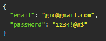
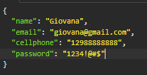
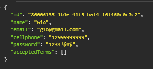
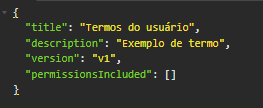
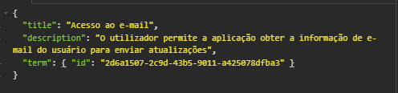
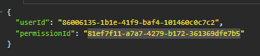

# 🚀 LGPD

O presente repositório contém o código do back-end com aplicação de regras da LGPD desenvolvido durante a aula de Segurança no Desenvolvimento de Aplicações da FATEC.

Selecione uma opção abaixo para saber mais:

- [Dependências;](#dependencias)
- [Como executar o projeto localmente;](#execucao_local)
- [Rotas disponíveis.](#rotas)

<span id="dependenciasl">

## ✨ Dependências


<span id="execucao_local">

## ✨ Como executar o projeto localmente

Para iniciar o projeto localmente, execute os comandos a seguir:

```
# Clone este repositório com o Git
git clone https://github.com/gioliveirass/fatec-SDA-lgpd.git

# Acesse a pasta do projeto e instale as dependências
cd fatec-SDA-lgpd
yarn

# Crie um container para o banco de dados postgres
docker-compose up -d

# Duplique o arquivo .env.config, renomeie para .env e preencha com as informações corretas

# Utilize o comando do TypeORM para dar o run da migration e sincronizar as entidades
yarn typeorm migration:run -d ./src/data-source.ts

# Inicie o Projeto
yarn start
```

<span id="rotas">

## ✨ Rotas disponíveis

Abaixo há um resumo das rotas disponíveis na aplicação.

Caso deseje, as requisições prontas para serem importadas no [Insomnia](https://insomnia.rest/download) estão disponíveis [aqui](https://github.com/gioliveirass/fatec-SDA-lgpd/blob/main/github/requests).

<table>
  <tr>
    <th>Rota</th>
    <th>Para que serve</th>
    <th>Exemplo de payload</th>
  </tr>
  <tr>
    <td></td>
    <td>Autenticar no sistema</td>
    <td></td>
  </tr>
  <tr>
    <td></td>
    <td>Cadastrar usuário no sistema</td>
    <td></td>
  </tr>
  <tr>
    <td></td>
    <td>Buscar por um usuário cadastrado</td>
    <td>Enviar ID do usuário na URL (users/:id)</td>
  </tr>
  <tr>
    <td></td>
    <td>Atualizar informações de um usuário</td>
    <td></td>
  </tr>
  <tr>
    <td></td>
    <td>Registrar um novo termo</td>
    <td></td>
  </tr>
  <tr>
    <td></td>
    <td>Buscar por um termo cadastrado</td>
    <td>Enviar ID do termo na URL (terms/:id)</td>
  </tr>
  <tr>
    <td></td>
    <td>Buscar por todos os termos cadastrados</td>
    <td>-</td>
  </tr>
  <tr>
    <td></td>
    <td>Buscar por uma permissão cadastrada</td>
    <td>Enviar ID da permissão na URL (permission/:id)</td>
  </tr>
  <tr>
    <td></td>
    <td>Cadastrar uma nova permissão</td>
    <td></td>
  </tr>
  <tr>
    <td></td>
    <td>Aceitar uma permissão existente</td>
    <td></td>
  </tr>
  <tr>
    <td></td>
    <td>Recusar uma permissão existente</td>
    <td></td>
  </tr>
</table>
